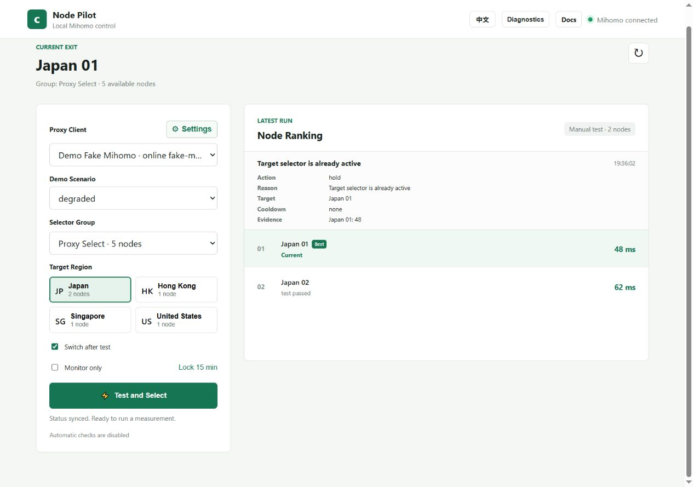

# Clash Node Pilot

[中文](README.zh-CN.md) | [Delivery roadmap / 路线图](docs/ROADMAP.md)

Clash Node Pilot is a local Windows dashboard for testing and switching Clash/Mihomo selector nodes by region and health score. It talks to the Mihomo external controller on the same machine, keeps controller secrets on the Node.js backend, and sends selector changes with PUT, then reads the controller state back and reports success only when the requested selection is confirmed.

> Unofficial project. Clash Node Pilot is not affiliated with Clash Verge Rev, Clash for Windows, Mihomo, v2rayN, OpenAI, or any proxy provider.

## Supported Scope



- Windows 10/11 x64 portable package.
- Clash Verge Rev, Clash for Windows, or another Clash/Mihomo-compatible client with an enabled local external controller.
- v2rayN 7.x detection is read-only in v0.2.0.
- Node.js 22.x is the CI-supported source runtime. The release zip bundles official Node.js 22.x for Windows x64.

No macOS, Linux, Android, iOS, Electron, browser extension, or ChatGPT/OpenAI integration is included in v0.2.0.

## Quick Start

Windows `Setup.exe` work for 0.3.0 is documented in the [installer guide](docs/windows-installer.md). The published 0.2.0 download remains a portable ZIP until the next release passes acceptance.

1. Obtain `clash-node-pilot-v0.2.0-windows-x64-portable.zip` and its checksum from [GitHub Releases](https://github.com/xuytwinter/clash-node-pilot/releases). Only tagged releases provide published assets.
2. Extract it to any local folder, including paths with spaces or Chinese characters.
3. Double-click `start-clash-node-pilot.cmd`.
4. Open `http://127.0.0.1:3210` if the browser does not open automatically.

The portable package includes `runtime\node.exe`. Users do not need Git, `npm install`, or a preinstalled Node.js runtime.

## What It Does

- Reads Mihomo selector groups and the current selected node.
- Detects the Clash Verge UI selected group when possible, then falls back to configured group names.
- Tests real nodes through the Mihomo `/delay` API with trusted HTTPS probe URLs.
- Scores nodes with latency, recent failures, jitter, cooldown, and switch threshold rules.
- Keeps the current region when healthy; crosses regions only after the current region fails and alternate same-region probe checks do not indicate a target outage.
- Confirms selector writes by reading the controller state after `PUT /proxies/:selector`.
- Records manual protection, monitor-only mode, history, last results, and health state under `%LOCALAPPDATA%\ClashNodePilot` by default.

Clash Node Pilot does not edit subscriptions, provider files, or real Clash/Mihomo YAML except reading the controller address and secret from the configured client file.

## Dashboard Modes

- Manual test: choose a selector group and region, then run a one-time test and optional switch.
- Automatic optimization: periodically rechecks the active region using historical health scoring, repeated samples, threshold and cooldown. Manual tests sort one-time latency measurements and do not use that automatic ranking policy.
- Connectivity heal: checks selected AI/general selector paths against fixed connectivity targets and switches only when a real node path is unhealthy.
- Monitor-only: records recommendations without writing selector changes.
- Demo mode: starts an isolated fake Mihomo controller and temp state directory for testing the UI without touching real client configs.

## Source Development

```powershell
git clone https://github.com/xuytwinter/clash-node-pilot.git
cd clash-node-pilot
npm test
npm start
```

Useful scripts:

```powershell
npm run demo
npm run benchmark
npm run benchmark -- --json
npm run smoke:package
```

The project has no third-party npm runtime dependencies.

## Configuration

| Environment variable | Purpose | Default |
| --- | --- | --- |
| `PORT` | Local dashboard port | `3210` |
| `CLASH_CONFIG` | Explicit Clash/Mihomo runtime config path | Auto-detect local clients |
| `CLASH_TARGET_GROUP` | Fallback selector group when the UI selected group cannot be read | Built-in fallback name |
| `CLASH_PILOT_STATE` | Explicit runtime state file path | `%LOCALAPPDATA%\ClashNodePilot\state.json` |
| `CLASH_PILOT_DEMO` | Use demo-safe controller discovery mode | unset |
| `CLASH_PILOT_DISABLE_AUTO_LOOP` | Disable the built-in automatic loop | unset |
| `CLASH_PILOT_DISABLE_OS_INTEGRATION` | Disable startup and OS integrations | unset |
| `SWITCH_THRESHOLD_MS` | Initial minimum score improvement before switching | `25` |
| `SWITCH_COOLDOWN_MINUTES` | Initial cooldown after a switch | `5` |
| `HEALTH_HALF_LIFE_MINUTES` | Initial decay half-life for historical health | `60` |
| `MANUAL_PAUSE_MINUTES` | Manual protection duration after external changes | `15` |
| `V2RAYN_HOME` | Explicit v2rayN directory for read-only detection | Auto-detect process path |

Runtime settings can also be changed from the dashboard and are persisted locally.

## Startup

From the portable folder:

```powershell
powershell.exe -ExecutionPolicy Bypass -File .\install-pilot-autostart.ps1
```

Administrator scheduled-task variant:

```powershell
powershell.exe -ExecutionPolicy Bypass -File .\install-autostart-admin.ps1
```

Uninstall startup entries:

```powershell
powershell.exe -ExecutionPolicy Bypass -File .\uninstall-pilot-autostart.ps1
```

The watchdog checks only this project's `/api/health`; controller disconnection does not trigger a Clash restart. It does not terminate Clash processes. The Node service owns automatic scheduling; legacy PowerShell loop entry points no longer schedule optimization. `-Port` or `PORT` selects the same port for launch, health checks and startup registration (default `3210`). Scripts prefer the bundled `runtime\node.exe` and fall back to `node.exe` from `PATH` during source development.

## Upgrade and Rollback

When upgrading to 0.2.0, stop the old Node Pilot instance, back up the state file and its `.bak`, and extract the package into a separate folder. Keep `CLASH_PILOT_STATE` consistent if customized, and reinstall startup entries from the new folder. Default state lives outside the application folder and is retained.

Supported older state is sanitized and migrated; invalid input is preserved and a valid backup is used when available. A newer unknown schema disables state writes and mutating actions. For rollback, use the older application with a separate copy of its matching pre-upgrade state, rather than overwriting newer state. Isolated migration and recovery tests do not establish successful upgrades on users' real machines. See [Compatibility](docs/compatibility.md).

## Local API and Diagnostics

Fetch `GET /api/session` for `{token}`, then send `x-pilot-session: <token>` on other `/api/` requests except `/api/health`. JSON POST requests also require `Content-Type: application/json`. The browser handles this automatically. Host/origin checks and the per-process token protect the browser boundary; they do not protect against malicious local processes running as the same user.

Diagnostics export uses a fixed field whitelist. Names, paths, endpoints and free text are omitted; identifiers are anonymous indices scoped to one report. Timestamps, timing statistics, counts and fixed status codes remain. Review the report before sharing. See [Security](SECURITY.md).

Synthetic benchmarks compare policies with unequal probe budgets and simulated step metrics, not measured internet recovery times or production superiority. See [benchmark methodology and tradeoffs](docs/benchmarks.md).

## Release Packaging

```powershell
powershell.exe -NoProfile -ExecutionPolicy Bypass -File .\release.ps1
npm run smoke:package
```

The version defaults to `package.json`. Packaging preserves old ZIPs, refuses to overwrite existing assets for the same version, and includes `BUILD-INFO.json` with source SHA and working-tree status. Native command failures stop the build and release workflow.

Candidate outputs:

- `outputs\clash-node-pilot-v0.2.0-windows-x64-portable.zip`
- `outputs\clash-node-pilot-v0.2.0-windows-x64-portable.zip.sha256`

## Documentation

- [Chinese README](README.zh-CN.md)
- [Architecture](docs/architecture.md)
- [Compatibility](docs/compatibility.md)
- [Demo Mode](docs/demo.md)
- [Benchmarks](docs/benchmarks.md)
- [Security Policy](SECURITY.md)

## License

[MIT](LICENSE)
